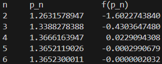

## 과제 내용
<br>

### **문제 설명**
다음 방정식의 근을 Secant method로 구하는 문제이다

$$
f(x) = x^3 + 4x^2 - 10 = 0
$$

문제에서 시작 값은 $p_0 = 1$, $p_1 = 2$로 둔다
$n=2,3,4,5,6$에 대해 $p_n$, $f(p_n)$을 표 형태로 출력한다
<br>

### **필요한 수학 : 할선법의 유도와 점화식**
할선법은 어떤 구간의 함수를 할선으로 근사하는 방법이다
할선과 x축의 교점을 다음 점으로 삼아 반복적으로 방정식의 근으로 근사하는 방법이다
할선은 두 점 $(p_{n-1}, f(p_{n-1}))$, $(p_n, f(p_n))$을 지나는 직선의 방정식이므로 $x$절편을 구해
아래의 식과 같이 다음 점을 구한다

$$
p_{n+1} = p_n - \frac{f(p_n)(p_n - p_{n-1})}{f(p_n) - f(p_{n-1})}
$$

### **코드 구현법**
<br>

### `double f(double x)`
과제의 대상 함수 $f(x)=x^3+4x^2-10$을 그대로 구현한다
<br>

### `double next_p(double (*f)(double), double p_n, double p_n_1)`
이전 두 점을 받아 점화식 $p_{n+1} = p_n - \frac{f(p_n)(p_n - p_{n-1})}{f(p_n) - f(p_{n-1})}$ 그대로 계산해
결과 $p_{n+1}$을 반환한다
<br>

### `double secant(int n, double (*f)(double), double p0, double p1)`
$p_0, p_1$를 초기값으로 받아 Secant method로 구한 $p_n$을 반환한다
오차가 주어진 TOL이하이거나 반복횟수가 초기 값보다 클때까지 반복적으로 구한다
<br>

### `int main()`
$n=2,3,4,5,6$에 대해 `secant(n, f, 1, 2)`를 호출하여 $p_n$, $f(p_n)$을 출력한다
<br>


```c
// 전체 소스코드

#include <stdio.h>
#include <math.h>

double f(double x)
{
    return pow(x, 3) + 4 * pow(x, 2) - 10;
}

double next_p(double (*f)(double), double p_n, double p_n_1)
{
    return p_n - f(p_n) * (p_n - p_n_1) / (f(p_n) - f(p_n_1));
}

void format(int n, double p_n, double f_p_n)
{
    printf("%d", n);

    if (p_n >= 0)
        printf("     ");
    else
        printf("    ");

    printf("%.10f", p_n);

    if (f_p_n >= 0)
        printf("     ");
    else
        printf("    ");

    printf("%.10f", f_p_n);

    printf("\n");
}

double secant(double TOL, int TRIAL, double (*f)(double), double p0, double p1)
{
    double p_n = 0, p_n_1 = p1, p_n_2 = p0;

    double tol = 0.005;
    int trial = 1;

    while (tol >= TOL && trial <= TRIAL)
    {
        double p_n = next_p(f, p_n_1, p_n_2);
        p_n_2 = p_n_1; p_n_1 = p_n;

        tol = fabs(p_n_1 - p_n_2); trial += 1;

        format(trial, p_n, f(p_n));
    }

    return p_n;
}

int main()
{
    printf("n     p_n             f(p_n)\n");
    double p_n = secant(0.0005, 20, f, 1, 2);

    return 0;
}
```
<br>

## 실행결과
