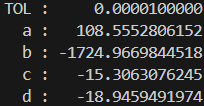

## **과제 내용**
본 과제는 적분을 Adaptive Quadrature를 사용해 주어진 오차 TOL 이내로 구하는 것이다
<br>

### **필요한 수학**
Adaptive Quadrature는 적분 근사 오차가 주어진 값 이내 일 때 까지
Simpson's Rule 을 사용할 구간을 쪼개는 것이다 Simpson's Rule 특성에 의해 아래 부등식이 성립한다

$$
S(a,b) = \text{함수 $f$의 구간 $[a,b]$ 적분을 Simpson's Rule로 구한 값}
$$

$$
\left| \int_{a}^{b}{f(x)dx} - \left(S\left(a,\frac{a+b}{2}\right) + S\left(\frac{a+b}{2}, b\right)\right) \right| 
$$

$$
\approx \left| S(a, b) - S\left(a,\frac{a+b}{2}\right) - S\left(\frac{a+b}{2}, b\right) \right| \le 15 \cdot TOL \tag{1}
$$

이므로 $[a,b]$에서 식 $(1)$을 만족하면 Composite Simpson's Rule로 구한 적분의 오차가 TOL 이내이므로 $S\left(a,\frac{a+b}{2}\right) + S\left(\frac{a+b}{2}, b\right)$ 로 적분을 근사한다
만족하지 않으면 오차가 TOL을 넘으므로 구간을 $\left[a,\frac{a+b}{2}\right], \left[\frac{a+b}{2}, b\right]$ 로 쪼개 다시 식(1)을 검사하면 된다
<br>

### **코드 구현법**

### `double f_a,b,c,d(double x)`
문제로 주어진 일변수함수를 구현한다
`typedef`를 이용해 위 함수의 함수 포인터 타입을 `func_t`라고 정의하였다
<br>

### `double S(func_t f, double a, double b)`
$$
\int_{a}^{b}{f(x) dx} \approx \frac{b-a}{6}\left[f(a) + 4f\left(\frac{a+b}{2}\right) + f(b)\right]
$$
위와 같은 Simpson's Rule로 구한 적분근사식의 우변을 반환한다
<br>

### `double AQ(func_t f, double a, double b, double TOL)`
식(1)을 이용해 구간 오차 검사 후
- 오차$\le TOL$
Composite Simpson's Rule 값 `S(f, a, b)` 반환
- 오차$> TOL$ 
왼쪽 구간 적분 값인 구간 $l:\left[a,\frac{a+b}{2}\right]$, $TOL = \frac{TOL}{2}$ 로 재귀호출 , 
오른쪽 구간 적분 값인 구간 $r:\left[\frac{a+b}{2}, b\right]$, $TOL = \frac{TOL}{2}$ 로 재귀호출
그 후 $l,r$ 구간의 적분값을 합해 반환

<br><br><br><br>

```c
// 전체 소스코드
#include <stdio.h>
#include <math.h>
typedef double (*func_t)(double);

double f_a(double x) {
    return exp(2 * x) * sin(3 * x);
}

double f_b(double x) {
    return exp(3 * x) * sin(2 * x);
}

double f_c(double x) {
    return 2 * x * cos(2 * x) - (x - 2) * (x - 2);
}

double f_d(double x) {
    return 4 * x * cos(2 * x) - (x - 2) * (x - 2);
}

double S(func_t f, double a, double b)
{
    return (f(a) + 4 * f((a + b) / 2) + f(b)) * (b - a) / 6;
}

double AQ(func_t f, double a, double b, double TOL)
{
    double o = S(f, a, b);
    double l = S(f, a, (a + b) / 2);
    double r = S(f, (a + b) / 2, b);
    if (fabs(o - l - r) <= 15 * TOL)
        return l + r;

    l = AQ(f, a, (a + b) / 2, TOL / 2);
    r = AQ(f, (a + b) / 2, b, TOL / 2);
    return l + r;
}

int main()
{
    double TOL = 1e-5;
    printf("TOL : %16.10f\n", TOL);

    printf("  a : %16.10f\n", AQ(f_a, 1, 3, TOL));
    printf("  b : %16.10f\n", AQ(f_b, 1, 3, TOL));
    printf("  c : %16.10f\n", AQ(f_c, 0, 5, TOL));
    printf("  d : %16.10f\n", AQ(f_d, 0, 5, TOL));

    return 0;
}
```
<br><br>

### **실행결과**

|참값(소수점 10자리까지)|근사값(실행결과)|
|:--:|:--:|
|`a : 108.5552812121`<br>`b : -1724.9669830093`<br>`c : -15.3063079856`<br>`d : -18.9459493046`||

결과에서 보듯 참값과 근사값은 모든 경우에 소수점 6자리 이하에서 달라져 $TOL = 10^{-5}$ 를 만족한다

참값은 울프럼알파로 계산하였다