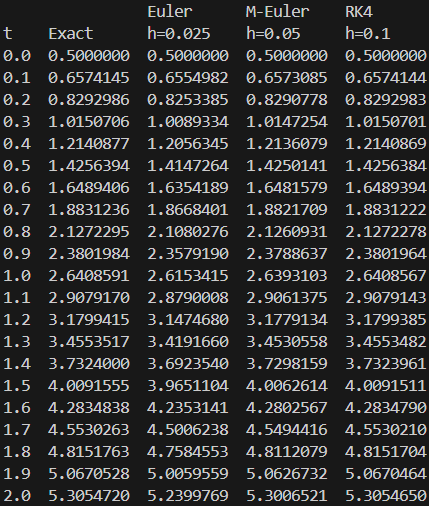
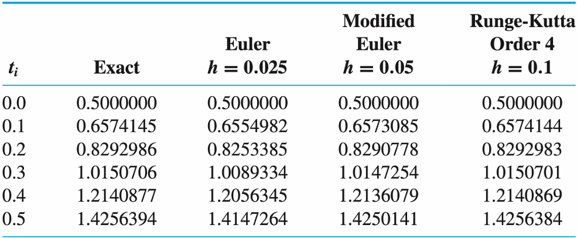

### **과제 설명**

본 과제는 초기값 문제

$$
\frac{d y}{d t} = f(t,y) = y -t^2 +1 ,\ y(0) = 0.5
$$

의 해를 Euler, Modified-Euler, RK4 방법을 이용해 수치적으로 구하는 과제이다
위 세 방법 모두 구할 구간을 $N$ 개의 스텝으로 나눠 첫 지점 부터 한 스텝씩 반복적으로 구하는 방법이다
초기값 문제의 정확한 해는 $y(t) = (t+1)^2 - 0.5e^t$ 이며 수치적으로 구한 값과 정확 해를 표로 나타내
비교할 수 있게 함이 목표이다
<br>

#### Euler Method

$$
w_{i+1} = w_{i} + hf(t_i, w_i) \tag{식 1}
$$

현재 함수값에 (현 시점에 주어진 미분 $f$) \* (스텝 크기)를 더해 다음 스텝의 함수값을 근사하는 기법이다
테일러 1차 전개를 사용한 효과를 낸다
<br>

#### Modified-Euler Method

$$
w_{i+1} = w_i +\frac{h}{2}[f(t_i, w_i) + f(t_{i+1}, w_i + hf(t_i, w_i))] \\\\
\rightarrow k_1 = f(t_i, w_i) ,\ k_2 = f(t_{i+1}, w_i + hk_1) \\\\
w_{i+1} = w_i + \frac{h}{2}[k_1 + k_2] \tag{식 2}
$$

(현 시점에 주어진 미분), (오일러 방법으로 예측한 다음 점에 주어진 미분) 을 평균내어 사용할 기울기를 정한 후,
(스텝 크기)를 곱해 현재 함수값에 더하여 다음 스텝의 함수값을 근사하는 기법이다
테일러 2차 전개를 사용한 효과를 낸다
구현 편의를 위해 중간변수 $k_1, k_2$ 를 사용하였다
<br>

#### RK4 Method

$$
k_1 = hf(t_i, w_i) ,\ k_2 = hf(t_i + \frac{h}{2}, w_i + \frac{1}{2}k_1) \\\\
k_3 = hf(t_i + \frac{h}{2}, w_i + \frac{1}{2}k_2) ,\ k_4 = hf(t_{i+1}, w_i + k_3) \\\\
w_{i+1} = w_{i} + \frac{1}{6}[k_1+2k_2+2k_3+k_4] \tag{식 3}
$$

|변수|의미|
|:--:|:--|
|$k_1$|현 상태에 주어진 기울기로 추정한 증분|
|$k_2$|$k_1$ 로 반 스텝 예측한 상태에 주어진 기울기로 추정한 증분|
|$k_3$|$k_2$ 로 반 스텝 예측한 상태에 주어진 기울기로 추정한 증분|
|$k_4$|$k_3$ 로 한 스텝 예측한 상태에 주어진 기울기로 추정한 증분|
|$w_{i+1}$|$k_i$ 들을 가중평균하여 예측한 한 스텝 뒤의 값|

테일러 4차 전개를 사용한 효과를 낸다

<br><br><br><br>

### **코드 구현법**

### `double f(double t, double y)`
문제로 주어진 $f(t,y)$를 구현한다
`typedef`를 이용해 위 함수의 함수 포인터 타입을 `func_t`라고 정의하였다

### `double exact_f(double t)`
위 초기값 문제의 정확한 해인 $y(t)$ 를 구현한다
<br>

### `double euler_step(double w, double h, func_t f, double t)`
현 시점의 $t, w$, 스텝사이즈 $h$, 주어진 미분 $f$ 를 받아 다음 시점의 함수값 $w_{i+1}$ 을
**Euler Method** 로 구한 후 반환한다. 식 (1)을 그대로 구현하였다

### `double M_euler_step(double w, double h, func_t f, double t)`
현 시점의 $t, w$, 스텝사이즈 $h$, 주어진 미분 $f$ 를 받아 다음 시점의 함수값 $w_{i+1}$ 을
**Modified-Euler Method** 로 구한 후 반환한다. 식 (2)을 그대로 구현하였다

### `double RK4_step(double w, double h, func_t f, double t)`
현 시점의 $t, w$, 스텝사이즈 $h$, 주어진 미분 $f$ 를 받아 다음 시점의 함수값 $w_{i+1}$ 을
**RK4 Method** 로 구한 후 반환한다. 식 (3)을 그대로 구현하였다
<br>

### `main`

||의미|
|:--:|:--|
|`exact`|현 시점 정확한 해 $y(t)$ 가 담김|
|`w_euler`|Euler Method로 구한 값이 담김|
|`w_M_euler`|Modified-Euler Method로 구한 값이 담김|
|`w_rk4`|RK4로 구한 값이 담김|
|초기 조건|`w_euler = w_M_euler = w_rk4 = 0.5` ($y(0)=0.5$)|
|스텝 사이즈|`h_euler=0.025`, `h_M_euler=0.05`, `h_rk4=0.1`|
|`step`|루프인덱스, 본 과제에선 $t=0$ 부터 $t=2$ 까지<br>$0.1$ 간격으로 값을 출력 하므로 루프는 $21$ 번 돌아야한다<br>따라서 `step`은 $0$ 부터 $20$ 까지 반복된다|

#### 메인 루프
각 반복에서 수행 내용
1. **`step`에 따른 `t`계산** : 본 과제에서는 $0.1$ 단위로 출력하므로 `t = step * 0.1`
  
2. **정확해 계산**: `exact = exact_f(t)`

3. **현재 시점의 계산값 출력** : `exact, w_euler, w_M_euler, w_rk4` 를 **시점 `t`** 에 맞춰 한 줄 출력
`step=0`에서는 초기조건 $t=0$ 에서의 값이 출력된다
이전 반복 끝에서 이미 다음 시점으로 업데이트했으므로, **출력, 계산** 순서가 자연스럽게 맞물린다

4. **다음 출력 값 계산** : 출력 간격이 $0.1$ 이므로, 각 반복의 끝에 **Euler**는 $4$ 회($h=0.025$), **Modified-Euler**는 $2$ 회($h=0.05$), **RK4**는 $1$ 회($h=0.1$) 계산을 수행한다.
이렇게 하면 **다음 반복에서 출력되는 값**이 정확히 `t + 0.1 (= 0.1 * (step + 1))` 시점에 대응한다. 구현에서는 `for` 문으로 Euler 4회, Modified-Euler 2회를 수행했다.

```cpp
//전체 소스코드
#include <stdio.h>
#include <math.h>
typedef double (*func_t)(double, double);

double f(double t, double y) {
    return y - t * t + 1;
}
double exact_f(double t) {
    return (t + 1) * (t + 1) - 0.5 * exp(t);
}

double euler_step(double w, double h, func_t f, double t) {
    return w + h * f(t, w);
}
double M_euler_step(double w, double h, func_t f, double t) {
    double k1 = f(t, w);
    double k2 = f(t + h, w + h * k1);
    return w + h / 2.0 * (k1 + k2);
}
double RK4_step(double w, double h, func_t f, double t) {
    double k1 = h * f(t, w);
    double k2 = h * f(t + h / 2, w + k1 / 2);
    double k3 = h * f(t + h / 2, w + k2 / 2);
    double k4 = h * f(t + h, w + k3);
    return w + 1.0 / 6.0 * (k1 + 2 * k2 + 2 * k3 + k4);
}

int main()
{
    double exact = 0.5;
    double w_euler = 0.5, w_M_euler = 0.5, w_rk4 = 0.5;
    double h_euler = 0.025, h_M_euler = 0.05, h_rk4 = 0.1;

    printf("                Euler      M-Euler    RK4\n");
    printf("t    Exact      h=0.025    h=0.05     h=0.1\n");

    for (int step = 0; step < 21; step += 1) {
        double t = step * 0.1;
        exact = exact_f(step * 0.1);
        
        printf("%.1f  %.7f  %.7f  %.7f  %.7f\n",
                t, exact, w_euler, w_M_euler, w_rk4);
        
        for (int i = 0; i < 4; i += 1)
            w_euler = euler_step(w_euler, h_euler, f, t + i * h_euler);
        for (int i = 0; i < 2; i += 1)
            w_M_euler = M_euler_step(w_M_euler, h_M_euler, f, t + i * h_M_euler);
        w_rk4 = RK4_step(w_rk4, h_rk4, f, t);
    }
    return 0;
}
```

<br>

### **실행결과**
|||
|:--:|:--:|
|||
|실행 결과|표 `Table.5.8`|

본 프로그램이 표 `Table.5.8`를 완벽히 재구성함을 알 수 있다
