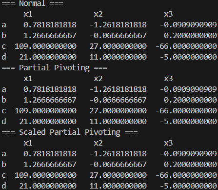

### 과제 설명
본 과제는 3×3 연립방정식 네 개를

* Gaussian elimination
* Gaussian elimination with partial pivoting
* Gaussian elimination with scaled partial pivoting

세 가지 방법으로 풀고, 각 방법에 대해 네 개의 시스템의 해를 비교해 보는 것이다.
문제에서 주어진 각 연립방정식은 다음과 같은 형태이며

$$
A\mathbf{x} = \mathbf{b} ,\quad A \in \mathbb{R}^{3\times3} \ \ \mathbf{x} , \mathbf{b} \in \mathbb{R}^3
$$

프로그램에서는 주어진 네 개의 계수행렬과 우변벡터를 각각 (a), (b), (c), (d)로 구분해 순서대로 해결한다.
<br>

### 필요한 수학
### Gaussian Elimination
가우스 소거법은 연립일차방정식 $A\mathbf{x}=\mathbf{b}$ 을 동치인 상삼각 시스템으로 바꾼 뒤,
backward substitution으로 해를 구하는 방법이다.
augmented matrix를 $[A\mid\mathbf{b}]$ 라 하자. 가우스 소거는 다음 두 종류의 연산만 써서 변환한다.

* 행 교환 : $R_i\leftrightarrow R_j$
* 어떤 행에 상수배해서 다른 행에 더하기 : $R_j\leftarrow R_j+\alpha R_i$

pivot 은 현재 단계에서 아래 원소들을 0으로 만들기 위해 기준으로 삼는 원소다.
$k$번째 열을 처리할 때 대각 원소 $a_{kk}$를 pivot으로 잡는다.

가우스 소거의 절차를 일반적인 $N\times N$ 시스템 기준으로 쓰면 다음과 같다.

1. $k=0,1,\dots,N-2$에 대해 $k$번째 열을 차례로 처리한다.
2. 현재 pivot이 $a_{kk}$인데, $a_{kk}=0$이면 같은 열에서 0이 아닌 원소를 가진 가장 가까운 아래쪽 행을
찾아 $R_k$와 교환한다.
$i>k$ 중에서 $a_{ik}\ne0$인 첫 행을 찾아 $R_k\leftrightarrow R_i$ 를 하여 pivot이 0이 아니게 만든다.
3. pivot이 정해졌으면, $k$번째 열의 아래쪽 원소들을 0으로 만든다.
각 아래쪽 행 $i=k+1,\dots,N-1$에 대해 $m_{ik}=\frac{a_{ik}}{a_{kk}}$ 를 계산하고
$R_i\leftarrow R_i-m_{ik}R_k$ 를 수행한다. 그러면 $k$번째 열에서 $i>k$인 모든 원소가 0이 된다.
4. 다음 열로 넘어가 같은 과정을 반복한다.

모든 열에 대해 위 과정을 끝내면 augmented matrix은 $[U\mid\tilde{\mathbf{b}}]$ 형태가 되며, $U$는 상삼각행렬이다.
원래 시스템은 $U\mathbf{x}=\tilde{\mathbf{b}}$ 라는 상삼각 시스템으로 변환된다.
<br><br><br>

### Backward Substitution
상삼각 시스템 $U\mathbf{x}=\tilde{\mathbf{b}}$ 에서는 마지막 미지수부터 바로 구할 수 있다.
예를 들어 $N$차 시스템에서 마지막 식은 $U_{N-1,N-1}x_{N-1}=\tilde b_{N-1}$ 이므로 $\displaystyle x_{N-1}=\frac{\tilde b_{N-1}}{U_{N-1,N-1}}$ 을 얻는다. 그 다음 위의 식으로 올라가며 이미 구한 값들을 대입한다. 일반적으로 $i=N-2,N-3,\dots,0$ 에 대해

$$x_i=\frac{1}{U_{ii}}\left(\tilde b_i-\sum_{j=i+1}^{N-1}U_{ij}x_j\right)$$

로 계산한다. 이 과정을 끝내면 해가 완성된다.

### Pivoting Strategies

가우스 소거에서 pivot을 어떤 기준으로 선택할지 정하는 규칙을 Pivoting Strategies 라고 한다.
pivot을 잘못 고르면 다음 문제가 생길 수 있다.

* pivot이 0은 아니지만 아주 작으면 $m_{ik}=a_{ik}/a_{kk}$가 매우 커져서, 행 연산 과정에서
round-off error가 크게 증폭된다.

Pivoting Strategies 는 계산이 멈추는 상황을 피하고 수치적 안정성을 높이기 위해 사용한다.
아래 두 방법은 대표적인 Pivoting Strategies 다.
<br>

### Partial Pivoting
각 단계 $k$에서 현재 열 $k$의 아래쪽 후보 행들 중 절댓값이 가장 큰 원소를 pivot으로 선택하는 방법이다.
절차는 다음과 같다.

1. 단계 $k$에서 후보 행 $i=k,k+1,\dots,N-1$에 대해 $|a_{ik}|$를 비교한다.
2. $|a_{ik}|$가 최대인 행 $p$를 찾아 $R_k\leftrightarrow R_p$ 로 교환한다.
3. 그 후에는 표준 가우스 소거와 동일하게 아래쪽을 소거한다.
<br>

### Scaled Partial Pivoting
행마다 값의 크기가 크게 다르면, $|a_{ik}|$만으로 pivot을 고르는 것이 왜곡될 수 있다.
이를 막기 위해 행의 전체 크기에 대한 상대적인 비율을 기준으로 pivot을 고른다.
절차는 다음과 같다.

1. 각 행 $i$에 대해 미리 스케일 팩터 $s_i=\max_j|a_{ij}|$ 를 계산해 둔다.
2. 단계 $k$에서 후보 행 $i\ge k$에 대해 비율 $r_i=\frac{|a_{ik}|}{s_i}$ 를 구한다.
3. $r_i$가 최대인 행 $p$를 선택해 $R_k\leftrightarrow R_p$ 로 교환한다. 행을 바꾸면 $s_i$도 같은 방식으로 함께 교환한다.
4. 이후 소거는 표준 가우스 소거와 동일하다.
<br>

### 코드 구현법

### 표현법
프로그램에서 연립방정식과 행렬은 다음처럼 표현한다. 
<br>

**시스템 저장(상수 배열)**
네 개의 3×3 시스템을 미리
`A_test[4][3][3]` : 4개의 계수행렬
`b_test[4][3]` : 4개의 우변벡터
로 하드코딩해 두었다. 각 인덱스가 (a),(b),(c),(d) 시스템에 대응한다. 
<br>

**계산용 행렬/벡터(동적 할당)**
실제 소거 과정에서 행렬이 계속 바뀌므로, 매 시스템을 풀 때마다
`double** A` : 길이 `N`의 행 포인터 배열을 만들고, `A[i]`를 길이 `N`인 `double` 배열로 할당한 2차원 구조
`double* b` : 길이 `N`인 우변 벡터
로 복사해 온 뒤 값이 덮어써지는 방식으로 변환한다. 
<br><br><br>

**Augmented matrix 표현 방식**
$[A\mid\mathbf{b}]$ 를 한 덩어리로 저장하지 않고, `A`와 `b`를 분리 저장한 채 행 연산(`add_scaled_row`, `swap_row`)에서 두 객체에 같은 연산을 동시에 적용하여 augmented matrix에 대한 행 연산과 완전히 같은 효과를 내도록 했다.
<br>

#### `void add_scaled_row(int src,double scale,int dst,double** A,double* b,int N)`
행 연산 $R_{\text{dst}}\leftarrow R_{\text{dst}}+\text{scale}\cdot R_{\text{src}}$ 을 augmented matrix 전체에 적용한다.
`dst`행의 모든 열에 대해 `A[dst][col] += scale*A[src][col]`을 수행하고, 같은 스케일을 우변에도
적용하여 `b[dst] += scale*b[src]`로 갱신한다.
행렬 `A`와 우변 `b`를 항상 같이 업데이트해서 augmented matrix를 저장하지 않아도 동일 효과가 나게 했다. 
<br>

#### `void swap_row(int src,int dst,double** A,double* b,int N)`
행 연산 $R_{\text{src}}\leftrightarrow R_{\text{dst}}$ 을 augmented matrix 전체에 적용한다.
`A`의 두 행을 열 단위로 전부 교환한 뒤, 우변 벡터도 `b[src]`와 `b[dst]`를 교환한다.
pivot이 있는 행을 위로 올릴 때 사용된다.
<br>

#### `void seek_nonzero(int d,double** A,double* b,int N)`
표준 Gaussian elimination에서 현재 pivot $a_{dd}$가 0이면 같은 열 아래쪽에서 0이 아닌 원소를 찾아
행을 바꿔 pivot을 0이 아니게 만든다.
`A[d][d]==0`이면 `row=d+1...N-1`을 순회하며 `A[row][d]!=0`인 첫 행을 찾고
`swap_row(d,row,...)`를 수행한다.
<br>

#### `void normal_gauss(double** A,double* b,int N)`
열 $k$에 대해 아래 원소를 $0$으로 만드는 아래 수식으로 표현되는 가우스 소거법을 수행한다

$$
m_{ik}=\frac{a_{ik}}{a_{kk}},\quad
R_i\leftarrow R_i-m_{ik}R_k\quad (i>k)
$$

각 열 `col`에서

1. `seek_nonzero(col,...)`로 pivot을 확보한 뒤
2. 아래 행 `row=col+1...N-1`에 대해 `factor = -A[row][col]/A[col][col]`를 계산하고
   `add_scaled_row(col,factor,row,...)`를 호출해 $R_{\text{row}}\leftarrow R_{\text{row}}+\text{factor}\cdot R_{\text{col}}$를 수행한다.

이 과정을 끝내면 `A`는 상삼각행렬이 되고, `b`도 그에 맞는 $\tilde{\mathbf{b}}$로 변환된다. 
<br>

#### `void seek_max(int d,double** A,double* b,int N)`<br>`void pivoting_gauss(double** A,double* b,int N)`

단계 $d$에서 아래 수식으로 나타나는 partial pivoting으로 가우스 소거법을 수행한다

$$
p=\arg\max_{i\ge d}|a_{id}|,\quad R_d\leftrightarrow R_p
$$

`seek_max`에서 `i=d...N-1`을 돌며 `fabs(A[i][d])`가 최대인 행 `max_idx`를 찾고 `swap_row(d,max_idx,...)`로 교환한다.
`pivoting_gauss`는 `normal_gauss`와 동일한 소거 루프를 가지되,
pivot 선택에서 매 단계 `seek_max`를 호출하는 점만 다르다.
<br><br>

#### `double* find_s(double** A,int N)`<br>`void seek_scaled_max(int d,double** A,double* b,double* s,int N)`<br>`void scaled_pivoting_gauss(double** A,double* b,int N)`

Scaled Partial Pivoting으로 가우스 소거법을 수행한다

1. 각 행의 스케일 팩터 $s_i=\max_j|a_{ij}|$ 를 미리 계산
2. 단계 $d$에서 비율 $r_i=\frac{|a_{id}|}{s_i}$ 가 최대인 행을 pivot으로 선택

`find_s`는 각 행을 스캔해서 최대 절댓값을 `s[i]`에 저장한 뒤 반환한다.
`seek_scaled_max`는 `fabs(A[i][d])/s[i]`를 비교하여 최대 비율 행을 찾고,
필요하면 `swap_row`와 함께 `s`도 같은 인덱스로 교환한다.
`scaled_pivoting_gauss`는 시작 시 `s=find_s(A,N)`을 한 번 계산하고,
각 단계에서 `seek_scaled_max`로 pivot을 고른 뒤 나머지 소거는 기존과 동일하게 처리한다.
<br>

#### `void backward_substitution(double** A,double* b,int N)`
상삼각 시스템 $U\mathbf{x}=\tilde{\mathbf{b}}$ 에 대해 아래 수식의 backward substitution을 구현한다.

$$
x_i=\frac{1}{u_{ii}}\left(\tilde b_i-\sum_{j=i+1}^{N-1}u_{ij}x_j\right)
$$

`i=N-1...0`으로 내려가며 이미 구한 `b[j](=x_j)`를 이용해 `temp += A[i][j]*b[j]`를 계산하고,
`b[i]=(b[i]-temp)/A[i][i]`로 덮어쓴다. 즉 별도 해 벡터 없이 `b` 자체가 해로 바뀐다.
<br>

### `main`
4개의 테스트 시스템 (a)~(d)을 대상으로

1. Gaussian elimination,
2. partial pivoting Gaussian elimination,
3. scaled partial pivoting Gaussian elimination

을 각각 적용해 해를 구하고, 각 방법별 결과를 표로 출력한다. 
<br>

**계산용 행렬/벡터 동적 할당**
`double** A`를 길이 `N`의 행 포인터 배열로 만들고, 각 `A[i]`를 길이 `N`의 `double` 배열로 할당한다.
`double* b`도 길이 `N`으로 할당한다. 이렇게 만든 `A,b`는 각 시스템을 풀 때마다 값이 덮어써지는
작업 공간이다.
<br>

**계산**
`i=0..3`에 대해 4개 시스템을 순회한다. 각 시스템마다 아래 4 단계를 수행한다.

1. `load_system(i,A,b)`로 원본 테스트 데이터를 작업 공간으로 복사,
2. `normal_gauss(A,b,N)`으로 상삼각화,
3. `backward_substitution(A,b,N)`으로 해를 `b`에 덮어쓰기,
4. `print_root(b,i)`로 한 행 출력

```c
// 전체 소스코드
#include <stdio.h>
#include <stdlib.h>
#include <math.h>
#include <string.h>

const int N = 3;
const int len_vec = N * sizeof(double);

// 테스트용 계수행렬, 우변 벡터
const double A_test[4][3][3] = { { { 1, -5,  1},
                                   {10,  0, 20},
                                   { 5,  0, -1} },
                                 { { 1,  1, -1},
                                   { 1,  1,  4},
                                   { 2, -1,  2} },
                                 { { 2, -3,  2},
                                   {-4,  2, -6},
                                   { 2,  2,  4} },
                                 { { 0,  1,  1},
                                   { 1, -2, -1},
                                   { 1, -1,  1} } };

const double b_test[4][3] = { { 7,  6,  4 },
                              { 1,  2,  3 },
                              { 5, 14,  8 },
                              { 6,  4,  5 } };

// 행 상수배 후 더하기: dst_row <- dst_row + scale * src_row
void add_scaled_row(int src, double scale, int dst, double** A, double* b, int N)
{
    for (int col = 0; col < N; col += 1)
        A[dst][col] += scale * A[src][col];
    b[dst] += scale * b[src];
}

// 교환: row src <-> row dst (A와 b 둘 다)
void swap_row(int src, int dst, double** A, double* b, int N)
{
    if (src == dst) return;

    for (int col = 0; col < N; col += 1)
    {
        double tmp = A[dst][col];
        A[dst][col] = A[src][col];
        A[src][col] = tmp;
    }

    double tmp_b = b[dst];
    b[dst] = b[src];
    b[src] = tmp_b;
}


// 피봇이 0이면 아래에서 첫 번째 non-zero 행을 찾아 교환
void seek_nonzero(int d, double** A, double* b, int N)
{
    if (A[d][d] != 0.0) return;

    for (int row = d + 1; row < N; row += 1)
    {
        if (A[row][d] != 0.0)
        {
            swap_row(d, row, A, b, N);
            return;
        }
    }
}

// 표준 가우스 소거
void normal_gauss(double** A, double* b, int N)
{
    for (int col = 0; col < N; col += 1)
    {
        seek_nonzero(col, A, b, N);

        for (int row = col + 1; row < N; row += 1)
        {
            double factor = -A[row][col] / A[col][col];
            add_scaled_row(col, factor, row, A, b, N);
        }
    }
}

// |A[i][d]|가 최대인 행을 d행과 교환
void seek_max(int d, double** A, double* b, int N)
{
    int max_idx = d;
    double max_val = fabs(A[d][d]);

    for (int i = d + 1; i < N; i += 1)
    {
        double v = fabs(A[i][d]);
        if (v > max_val)
        {
            max_val = v;
            max_idx = i;
        }
    }

    swap_row(d, max_idx, A, b, N);
}

// partial pivoting
void pivoting_gauss(double** A, double* b, int N)
{
    for (int col = 0; col < N; col += 1)
    {
        seek_max(col, A, b, N);

        for (int row = col + 1; row < N; row += 1)
        {
            double factor = -A[row][col] / A[col][col];
            add_scaled_row(col, factor, row, A, b, N);
        }
    }
}

// 스케일 팩터 배열 s 계산: s[i] = max_j |A[i][j]|
double* find_s(double** A, int N)
{
    double* s = (double*) malloc(len_vec);

    for (int i = 0; i < N; i += 1)
    {
        double max_v = fabs(A[i][0]);
        for (int j = 1; j < N; j += 1)
        {
            double v = fabs(A[i][j]);
            if (v > max_v) max_v = v;
        }
        s[i] = max_v;
    }

    return s;
}

// 스케일드 부분 피봇팅: |A[i][d]| / s[i] 가 최대인 행을 선택해서 d행과 교환
void seek_scaled_max(int d, double** A, double* b, double* s, int N)
{
    int max_idx = d;
    double max_ratio = fabs(A[d][d]) / s[d];

    for (int i = d + 1; i < N; i += 1)
    {
        double ratio = fabs(A[i][d]) / s[i];
        if (ratio > max_ratio)
        {
            max_ratio = ratio;
            max_idx = i;
        }
    }

    if (max_idx != d)
    {
        swap_row(d, max_idx, A, b, N);

        // 행과 함께 스케일 팩터도 교환
        double tmp = s[d];
        s[d] = s[max_idx];
        s[max_idx] = tmp;
    }
}

// 스케일드 부분 피봇팅
void scaled_pivoting_gauss(double** A, double* b, int N)
{
    double* s = find_s(A, N);  // 초기 스케일 팩터 한 번 계산

    for (int col = 0; col < N; col += 1)
    {
        seek_scaled_max(col, A, b, s, N);

        for (int row = col + 1; row < N; row += 1)
        {
            double factor = -A[row][col] / A[col][col];
            add_scaled_row(col, factor, row, A, b, N);
        }
    }

    free(s);
}

// backward substitution): Ux = b (상 삼각행렬 U)
void backward_substitution(double** A, double* b, int N)
{
    for (int i = N - 1; i >= 0; i -= 1)
    {
        double temp = 0.0;
        for (int j = i + 1; j < N; j += 1)
            temp += A[i][j] * b[j];

        b[i] = (b[i] - temp) / A[i][i];
    }
}

// 해를 표 형태로 출력, 행 a,b,c,d가 각각 4개의 시스템에 대응
void print_root(double* b, int n)
{
    const char row_name[4] = { 'a', 'b', 'c', 'd' };
    printf("%c  ", row_name[n]);
    for (int j = 0; j < N; j += 1)
    {
        printf("%14.10f", b[j]); printf("  ");
    }
    printf("\n");
}

// 테스트용 시스템 로딩: idx번째 시스템을 A,b에 복사
void load_system(int idx, double** A, double* b)
{
    for (int r = 0; r < N; r += 1)
        memcpy(A[r], A_test[idx][r], len_vec);
    memcpy(b, b_test[idx], len_vec);
}


int main(void)
{
    // 사용할 배열 동적할당
    double** A = (double**) malloc(N * sizeof(double*));
    for (int i = 0; i < N; i += 1)
        A[i] = (double*) malloc(len_vec);
    double* b = (double*) malloc(len_vec);

    printf("=== Normal ===\n");
    printf("     x1              x2              x3\n");
    for (int i = 0; i < 4; i += 1)
    {
        load_system(i, A, b);
        normal_gauss(A, b, N);
        backward_substitution(A, b, N);
        print_root(b, i);
    }

    printf("=== Partial Pivoting ===\n");
    printf("     x1              x2              x3\n");
    for (int i = 0; i < 4; i += 1)
    {
        load_system(i, A, b);
        pivoting_gauss(A, b, N);
        backward_substitution(A, b, N);
        print_root(b, i);
    }

    printf("=== Scaled Partial Pivoting ===\n");
    printf("     x1              x2              x3\n");
    for (int i = 0; i < 4; i += 1)
    {
        load_system(i, A, b);
        scaled_pivoting_gauss(A, b, N);
        backward_substitution(A, b, N);
        print_root(b, i);
    }

    // 해제
    free(b);
    for (int i = 0; i < N; i += 1)
        free(A[i]);
    free(A);

    return 0;
}
```

<br><br><br><br><br><br><br>

### 실행 결과



||$x_1$|$x_2$|$x_3$|
|--:|:--|:--|:--|
|`a`|$0.7818181818$|$-1.2618181818$|$-0.0909090909$|
|`b`|$1.2666666667$|$-0.0666666667$|$0.2$|
|`c`|$109$|$27$|$-66$|
|`d`|$21$|$11$|$-5$|

(소수점 11번째 자리에서 반올림)

세 방법 모두에서 계산된 해는 참값과 비교했을 때 소수점 아홉 자리까지 일치하며,
주어진 문제의 범위에서는 세 방법 모두 정확한 해를 안정적으로 계산함을 확인할 수 있었다.