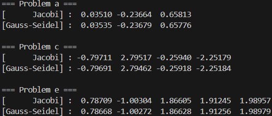

### **과제 설명**
본 과제는 **Jacobi Method**와 **Gauss-Seidel Method**를 이용하여 다음 세 개의 연립일차방정식 시스템의 해를 수치적으로 구하는 것이다

  * **A** : $3 \times 3$ 시스템  **C** : $4 \times 4$ 시스템 **E** : $5 \times 5$ 시스템

각 시스템 $A\mathbf{x}=\mathbf{b}$ 에 대해 초기값 $\mathbf{x}^{(0)} = \mathbf{0}$, 허용 오차 $TOL=10^{-3}$ 으로 설정하여 해를 근사하며,
두 방법의 수렴 결과를 비교한다
<br>

### **필요한 수학**

### **Matrix Splitting**
$n \times n$ 행렬 $A$를 다음과 같이 대각행렬 $D$, 나머지 부분인 하삼각행렬 $L$, 상삼각행렬 $U$로 분해한다
편의를 위해 $A$의 성분을 $D, L, U$로 나눌 때 부호를 조정하여 다음 관계가 성립하도록 정의한다

$$
A = D - L - U
$$

여기서 $D$는 $A$의 대각성분, $L$과 $U$는 각각 $A$의 하삼각, 상삼각 성분에 $-1$을 곱한 행렬이다
이를 이용해 $A\mathbf{x}=\mathbf{b}$ 를 반복법 형태인 $\mathbf{x} = T\mathbf{x} + \mathbf{g}$ 꼴로 변형하여 해를 구한다

### **Jacobi Method**
Jacobi 방법은 $k$번째 근사해 $\mathbf{x}^{(k)}$를 이용해 다음 해를 구할 때, 이전 단계의 값만을 사용한다
수식으로는 $D\mathbf{x} = (L+U)\mathbf{x} + \mathbf{b}$ 로 변형하여 다음과 같이 반복한다

$$
\mathbf{x}^{(k+1)} = D^{-1}(L+U)\mathbf{x}^{(k)} + D^{-1}\mathbf{b}
$$

반복 행렬 $T$와 벡터 $\mathbf{g}$는 다음과 같다

$$
T = D^{-1}(L+U) ,\quad \mathbf{g} = D^{-1}\mathbf{b}
$$

### **Gauss-Seidel Method**
Gauss-Seidel 방법은 값을 갱신할 때 이미 계산된 현재 단계의 최신 성분을 **즉시** 사용한다
행렬로 표현하면 $(D-L)\mathbf{x} = U\mathbf{x} + \mathbf{b}$ 형태가 되어 다음과 같이 반복한다

$$
\mathbf{x}^{(k+1)} = (D-L)^{-1}U\mathbf{x}^{(k)} + (D-L)^{-1}\mathbf{b}
$$

반복 행렬 $T$와 벡터 $\mathbf{g}$는 다음과 같다

$$
T = (D-L)^{-1}U ,\quad \mathbf{g} = (D-L)^{-1}\mathbf{b}
$$

### **Stopping Criteria**
반복의 종료 조건으로는 무한 노름($L_\infty \text{ norm}$)을 사용한 값의 변화가 $TOL$ 미만이 될 때를 기준으로 한다

$$
\lVert \mathbf{x}^{(k)} - \mathbf{x}^{(k-1)} \rVert_{\infty} = \max_{i} | x_{i}^{(k)} - x_{i}^{(k-1)} | < TOL
$$
<br><br><br>

### **코드 구현법**
<br>

**구현 개요**
하나의 C 프로그램 안에서 Jacobi Method와 Gauss-Seidel Method를 모두 지원하는 공통 솔버를 구현한다. 계수행렬의 크기가 바뀌어도 같은 코드를 재사용할 수 있도록 모든 벡터와 행렬은 동적 할당으로 관리한다.

반복법의 핵심 로직은 일반적인 반복법 $\mathbf{x}^{(k+1)} = T \mathbf{x}^{(k)} + \mathbf{g}$ 형태로 통일하며
Jacobi와 Gauss-Seidel 사이의 차이는 반복 행렬 $T$ 와 상수 벡터 $\mathbf{g}$ 를 계산하는 부분에만 둔다.

이 구조 덕분에 메모리 관리, 행렬·벡터 연산, 반복 종료 판정 같은 공통 부분은 한 번만 구현하고
Jacobi / Gauss-Seidel 고유 부분만 별도 함수로 분리할 수 있다.
<br>

### **동적 메모리 관리 함수**

### `double* alloc_vec(int n)`
길이 $n$ 인 실수 벡터를 동적 할당하여 그 포인터를 반환한다.
반환된 포인터는 반복법의 해 벡터, 오차 벡터 등 일반적인 $n$ 차원 벡터로 사용된다.
<br>

### `double** alloc_mat(int n)` 
$n \times n$ 크기의 실수 행렬을 이중 포인터 형태로 동적 할당한다.
먼저 행을 가리키는 포인터 배열을 길이 $n$ 으로 할당하고 각 행마다 길이 $n$ 인 `double` 배열을 따로 할당하는 방식이다.
<br>

### `void free_vec(double* v)` `void free_mat(double** m, int n)` 
`free_vec`은 `alloc_vec` 으로 할당한 벡터를 해제한다.
`free_mat`은 행렬의 각 행을 먼저 `free` 한 뒤 마지막에 행 포인터 배열을 해제한다.

이 함수들을 이용하여 Jacobi와 Gauss-Seidel 계산에 필요한 모든 메모리를 문제 크기와 무관하게 동적으로 생성하고 사용이 끝나면 안전하게 해제한다.
<br>

### **선형대수 연산 함수**

### `void mat_vec_mul(double** A, double* x, double* y, int n)` 
행렬-벡터 곱 $\mathbf{y} = A \mathbf{x}$ 를 계산한다. 이중 `for` 루프를 사용, 각 행 $i$ 에 대해 $\displaystyle y_i = \sum_{j=0}^{n-1} a_{ij} x_j$ 를 구현.
<br>

### `void mat_mul(double** A, double** B, double** C, int n)` 
행렬 곱 $C = A B$ 를 계산한다. 삼중 `for` 루프를 사용, $\displaystyle c_{ij} = \sum_{k=0}^{n-1} a_{ik} b_{kj}$ 를 구현.
Gauss-Seidel Method에서 $(D - L)^{-1} U$ 를 계산하여 반복 행렬 $T_{GS}$ 를 만들 때 사용된다.
<br>

### `void copy_vec(double* src, double* dst, int n)`
길이 $n$ 인 벡터를 원소별로 복사한다. 반복 과정에서 $\mathbf{x}^{(k+1)}$ 를 다음 반복의 $\mathbf{x}^{(k)}$ 로 옮길 때 사용한다.

### `void zeros_vec(double* v, int n)` 
벡터의 모든 성분을 $0$ 으로 초기화한다. 초기 근사해 $\mathbf{x}^{(0)} = \mathbf{0}$ 를 설정할 때 사용된다.
<br>

### **행렬 분해와 Jacobi 반복 행렬 생성**

### `void A_to_DLU(double** A, double** D, double** L, double** U, int n)`
계수행렬 $A$ 를 $D$, $L$, $U$ 로 분해한다.

* $D$ : $A$ 의 대각 성분만을 가진 대각 행렬
* $L$ : $i > j$ 인 하삼각 위치에 $-a_{ij}$ 를 저장하는 행렬
* $U$ : $i < j$ 인 상삼각 위치에 $-a_{ij}$ 를 저장하는 행렬

모든 위치에 대해 먼저 $D$, $L$, $U$ 를 $0$ 으로 초기화한 뒤 위 규칙에 따라 값을 채우면
$A = D - L - U$ 가 항상 성립하도록 $D$, $L$, $U$ 를 구성할 수 있다.
이후 Jacobi와 Gauss-Seidel 반복 행렬을 만드는 모든 과정은 이 $D$, $L$, $U$ 를 기반으로 한다.
<br><br>

### `void get_jacobi_matrices(double** D, double** L, double** U, double* b, double** T, double* g, int n)` 
Jacobi Method에 사용할 반복 행렬 $T_J$ 와 상수벡터 $\mathbf{g}_J$ 를 계산한다.

각 행 $i$ 에 대해 대각 원소의 역수 $\displaystyle d_\text{inv} = \frac{1}{D[i][i]}$ 를 먼저 구하고 이를 이용해
$\displaystyle g_i = d_\text{inv} b_i = \frac{b_i}{a_{ii}}$를 계산하여 $g[i]$ 에 저장한다.

반복 행렬의 원소는 $T_{ij} = d_\text{inv} (L_{ij} + U_{ij})$ 로 계산한다.
이는 이론에서 정의한 $T_J = D^{-1} (L + U), \ \mathbf{g}_J = D^{-1} \mathbf{b}$ 를 그대로 코드로 옮긴 것이다.
<br>

### **하삼각 역행렬과 Gauss-Seidel 반복 행렬 생성**

### `void invert_lower_matrix(double** Low, double** Low_inv, int n)`
대각 성분이 모두 $0$ 이 아닌 하삼각 행렬 `Low` 의 역행렬 `Low_inv` 를 구한다.

역행렬의 각 열은 $\text{Low} \mathbf{x}_j = \mathbf{e}_j$ 형태의 선형시스템 해 $\mathbf{x}_j$ 로 얻을 수 있다.
여기서 $\mathbf{e}_j$ 는 $j$ 번째 표준 기저이다.
하삼각 행렬의 해는 위에서 아래로 내려가며 계산하는 forward substitution 으로 구할 수 있으며
이 과정을 $j = 0, \dots, n-1$ 에 대해 반복하여 `Low_inv` 의 모든 열을 채운다.
<br>

### `void get_gauss_seidal_matrices(double** D, double** L, double** U, double* b, double** T, double* g, int n)`
Gauss-Seidel Method에서 사용할 반복 행렬 $T_{GS}$ 와 상수벡터 $\mathbf{g}_{GS}$ 를 생성한다.

1. 먼저 $D$ 와 $L$ 을 사용하여 $DL = D - L$ 을 계산한다.
이는 이론에서 정의한 $(D - L)$ 형태의 하삼각 행렬에 해당한다.
2. `invert_lower_matrix(DL, DL_inv, n)` 을 호출하여 $DL^{-1} = (D - L)^{-1}$을 구한다.
3. 행렬 곱을 이용하여 $T_{GS} = (D - L)^{-1} U $를 계산한다. `mat_mul(DL_inv, U, T, n)` 으로 구현된다.
4. 벡터 곱을 이용하여 $\mathbf{g}_{GS} = (D - L)^{-1} \mathbf{b}$ 를 계산한다. `mat_vec_mul(DL_inv, b, g, n)` 으로 구현된다.

계산에 사용된 보조 행렬 `DL` 과 `DL_inv` 는 사용 후 `free_mat` 으로 해제한다.

이 과정을 통해 Jacobi와 Gauss-Seidel 두 방법 모두를
$$
\mathbf{x}^{(k+1)} = T \mathbf{x}^{(k)} + \mathbf{g}
$$
형태의 공통된 반복 구조로 통일하여 다룰 수 있다.
<br><br><br><br><br><br><br>

### **반복법 공통 로직**

### `double get_inf_norm_error(double* x_new, double* x_old, int n)`
두 근사해 $\mathbf{x}^{(k+1)}$ 과 $\mathbf{x}^{(k)}$ 의 차이 벡터에 대한 무한 노름 $\lVert \mathbf{x}^{(k+1)} - \mathbf{x}^{(k)} \rVert_\infty$ 을 계산한다.
각 성분의 차이의 절댓값을 구한 뒤 그 중 최댓값을 반환하며 이 값을 반복법의 오차로 사용한다.
<br>

### `double* solver(double** A, double* b, int n, char method, double TOL, int MAX_ITER)`
Jacobi와 Gauss-Seidel를 모두 처리하는 통합 반복 솔버이다.
동작 순서는 다음과 같다.

1. `alloc_mat` 과 `A_to_DLU` 를 이용해 $A$ 를 $D$, $L$, $U$ 로 분해한다.
2. 반복 행렬 $T$ 와 상수벡터 $g$ 를 위한 메모리를 할당한다.
3. `method` 가 `'J'` 이면 `get_jacobi_matrices` 를 호출해 $T _ J$ 와 $\mathbf{g} _ J$ 를 생성하고
`'G'` 이면 `get_gauss_seidal_matrices` 를 호출해 $T _ {GS}$ 와 $\mathbf{g} _ {GS}$ 를 생성한다.
4. 근사해 벡터 `x_old`,`x_new` 를 할당, `zeros_vec(x_old, n)` 으로 초기값 $\mathbf{x}^{(0)} = \mathbf{0}$ 을 설정한다.
5. 반복 루프 안에서 다음을 수행한다.

   * `mat_vec_mul(T, x_old, x_new, n)` 으로 $T \mathbf{x}^{(k)}$ 를 계산한다.
   * 각 성분에 `g[i]` 를 더하여 $\mathbf{x}^{(k+1)}$ 를 완성한다.
   * `get_inf_norm_error(x_new, x_old, n)` 로 오차 $\text{error} = \lVert \mathbf{x}^{(k+1)} - \mathbf{x}^{(k)} \rVert_\infty$ 를 계산
   * `copy_vec(x_new, x_old, n)` 로 $\mathbf{x}^{(k)} \leftarrow \mathbf{x}^{(k+1)}$ 를 수행하여 다음 반복을 준비한다.
   * 반복 횟수 `iter` 를 1 증가시킨다.
6. 오차가 `TOL` 보다 작아지거나 반복 횟수가 `MAX_ITER` 에 도달하면 반복을 종료한다.

마지막으로 $D$, $L$, $U$, $T$, $g$, $x_{new}$ 의 메모리를 모두 해제하고 최종 근사해인 `x_old` 포인터를 반환한다.
<br>

### `void run_problem(char name, int n, const double* flat_A, const double* src_b, double TOL, int MAX_ITER)`
Problem A, C, E 각각에 대해 Jacobi와 Gauss-Seidel를 모두 수행하는 보조 함수이다.

1. 1차원 배열 `flat_A` 에 저장된 계수들을 $n \times n$ 행렬 `A` 로 복원한다.
2. 우변 벡터 `src_b` 를 길이 $n$ 인 벡터 `b` 에 복사한다.
이때 `b` 는 각 문제에서 주어진 상수들로 채워지며 주어진 데이터로부터 온 상수벡터라고 볼 수 있다.
3. Jacobi Method : `solver(A, b, n, 'J', TOL, MAX_ITER)` 를 호출하고 결과를 출력한다.
4. Gauss-Seidel Method : `solver(A, b, n, 'G', TOL, MAX_ITER)` 를 호출하고 결과를 출력한다.
5. `A` 와 `b` 그리고 각 해 벡터의 메모리를 모두 해제한다.

### `main`
세 문제의 계수행렬과 우변벡터를 상수 배열로 정의한다.

* Problem A 에 대해 크기 $3 \times 3$ 의 행렬 `MAT_A_a` 와 길이 3 인 벡터 `VEC_b_a` 를 정의한다.
* Problem C 에 대해 크기 $4 \times 4$ 의 행렬 `MAT_A_c` 와 길이 4 인 벡터 `VEC_b_c` 를 정의한다.
* Problem E 에 대해 크기 $5 \times 5$ 의 행렬 `MAT_A_e` 와 길이 5 인 벡터 `VEC_b_e` 를 정의한다.

허용 오차 `TOL` 과 최대 반복 횟수 `MAX_ITER` 를 설정한 뒤 각 문제에 대해 `run_problem` 을 호출하여
Jacobi와 Gauss-Seidel 두 방법의 결과를 차례대로 출력한다.

```c
//전체 소스코드
#include <stdio.h>
#include <stdlib.h>
#include <math.h>
#include <string.h>

// 메모리 관리 공용함수 ======================
double* alloc_vec(int n)
{
    return (double*) malloc(n * sizeof(double));
}

double** alloc_mat(int n)
{
    double** m = (double**) malloc(n * sizeof(double*));
    for (int i = 0; i < n; i += 1)
    {
        m[i] = (double*) malloc(n * sizeof(double));
    }
    return m;
}

void free_vec(double* v)
{
    free(v);
}

void free_mat(double** m, int n)
{
    for (int i = 0; i < n; i += 1)
    {
        free(m[i]);
    }
    free(m);
}

// 선형대수 연산 공용 함수 ==========================
void mat_vec_mul(double** A, double* x, double* y, int n)
{
    for (int i = 0; i < n; i += 1)
    {
        y[i] = 0.0;
        for (int j = 0; j < n; j += 1)
        {
            y[i] += A[i][j] * x[j];
        }
    }
}

void mat_mul(double** A, double** B, double** C, int n)
{
    for (int i = 0; i < n; i += 1)
    {
        for (int j = 0; j < n; j += 1)
        {
            C[i][j] = 0.0;
            for (int k = 0; k < n; k += 1)
            {
                C[i][j] += A[i][k] * B[k][j];
            }
        }
    }
}

void copy_vec(double* src, double* dst, int n)
{
    for (int i = 0; i < n; i += 1)
    {
        dst[i] = src[i];
    }
}

void zeros_vec(double* v, int n)
{
    for (int i = 0; i < n; i += 1) v[i] = 0.0;
}

// 행렬 분해 및 반복 행렬 생성 =======================================
void A_to_DLU(double** A, double** D, double** L, double** U, int n)
{
    for (int i = 0; i < n; i += 1)
    {
        for (int j = 0; j < n; j += 1)
        {
            D[i][j] = 0.0; L[i][j] = 0.0; U[i][j] = 0.0;
            if (i == j)      D[i][j] = A[i][j];
            else if (i > j)  L[i][j] = -A[i][j];
            else             U[i][j] = -A[i][j];
        }
    }
}

void get_jacobi_matrices(double** D, double** L, double** U, double* b, double** T, double* g, int n)
{
    for (int i = 0; i < n; i += 1)
    {
        double d_inv = 1.0 / D[i][i];
        g[i] = b[i] * d_inv;
        for (int j = 0; j < n; j += 1)
        {
            T[i][j] = (L[i][j] + U[i][j]) * d_inv;
        }
    }
}

// 가우스 세이델의 T=(D-L)^{-1}U 중 (D-L)^{-1} 를 구하는 용도
void invert_lower_matrix(double** Low, double** Low_inv, int n)
{
    for (int j = 0; j < n; j += 1)
    {
        for (int i = 0; i < n; i += 1)
        {
            double rhs = (i == j) ? 1.0 : 0.0;
            double sum = 0.0;
            for (int k = 0; k < i; k += 1)
            {
                sum += Low[i][k] * Low_inv[k][j];
            }
            Low_inv[i][j] = (rhs - sum) / Low[i][i];
        }
    }
}

void get_gauss_seidal_matrices(double** D, double** L, double** U, double* b, double** T, double* g, int n)
{
    double** DL = alloc_mat(n);
    double** DL_inv = alloc_mat(n);

    for (int i = 0; i < n; i += 1)
    {
        for (int j = 0; j < n; j += 1)
        {
            DL[i][j] = D[i][j] - L[i][j];
        }
    }

    invert_lower_matrix(DL, DL_inv, n);
    mat_mul(DL_inv, U, T, n);
    mat_vec_mul(DL_inv, b, g, n);

    free_mat(DL, n);
    free_mat(DL_inv, n);
}

// 반복법으로 풀이 ===================================================

// 오차는 무한 norm을 사용한다
double get_inf_norm_error(double* x_new, double* x_old, int n)
{
    double max_diff = 0.0;
    for (int i = 0; i < n; i += 1)
    {
        double diff = fabs(x_new[i] - x_old[i]);
        if (diff > max_diff) max_diff = diff;
    }
    return max_diff;
}

// 풀이 본체 =========
double* solver(double** A, double* b, int n, char method, double TOL, int MAX_ITER)
{
    //동적 할당
    double** D = alloc_mat(n); double** L = alloc_mat(n);
    double** U = alloc_mat(n);
    A_to_DLU(A, D, L, U, n);

    double** T = alloc_mat(n); double* g = alloc_vec(n);
    if (method == 'J')      get_jacobi_matrices(D, L, U, b, T, g, n);
    else if (method == 'G') get_gauss_seidal_matrices(D, L, U, b, T, g, n);

    double* x_old = alloc_vec(n); double* x_new = alloc_vec(n);
    zeros_vec(x_old, n); // 0으로 초기화

    // 반복횟수, 오차
    int iter = 0;
    double error = 0.0;

    do
    {
        // x_{n+1} = Tx_{n} + g
        mat_vec_mul(T, x_old, x_new, n);
        for (int i = 0; i < n; i += 1) x_new[i] += g[i];
        // 계산된 x_new, 기존 x_old 오차 계산
        error = get_inf_norm_error(x_new, x_old, n);
        // 반복을 위해 x_old <- x_new 갱신
        iter += 1; copy_vec(x_new, x_old, n);
    } while (error >= TOL && iter < MAX_ITER); // 인자로 받은 TOL, MAX_ITER 사용

    free_mat(D, n); free_mat(L, n); free_mat(U, n);
    free_mat(T, n); free_vec(g);
    free_vec(x_new);

    return x_old;
}

// 테스트 케이스 실행 ============================================
void print_result(const char* label, double* x, int n)
{
    printf("[%12s] :", label);
    for (int i = 0; i < n; i += 1)
    {
        printf("%9.5f", x[i]);
    }
    printf("\n");
}

void run_problem(char name, int n, const double* flat_A, const double* src_b, double TOL, int MAX_ITER)
{
    printf("\n=== Problem %c ===\n", name);
    // 할당 및 복사
    double** A = alloc_mat(n);
    double* b = alloc_vec(n);
    for (int i = 0; i < n; i += 1)
    {
        b[i] = src_b[i];
        for (int j = 0; j < n; j += 1)
        {
            A[i][j] = flat_A[i * n + j];
        }
    }
    // Jacobi
    double* sol_j = solver(A, b, n, 'J', TOL, MAX_ITER);
    print_result("Jacobi", sol_j, n);
    free_vec(sol_j);
    // Gauss-Seidel
    double* sol_g = solver(A, b, n, 'G', TOL, MAX_ITER);
    print_result("Gauss-Seidel", sol_g, n);
    free_vec(sol_g);
    // 메모리 해제
    free_mat(A, n);
    free_vec(b);
}

int main(void)
{
    // Problem A
    const int N_a = 3;
    const double MAT_A_a[3][3] = {
        { 3, -1,  1},
        { 3,  6,  2},
        { 3,  3,  7}
    };
    const double VEC_b_a[3] = { 1, 0, 4 };
    // Problem C
    const int N_c = 4;
    const double MAT_A_c[4][4] = {
        {10,  5,  0,  0},
        { 5, 10, -4,  0},
        { 0, -4,  8, -1},
        { 0,  0, -1,  5}
    };
    const double VEC_b_c[4] = { 6, 25, -11, -11 };
    // Problem E
    const int N_e = 5;
    const double MAT_A_e[5][5] = {
        { 4,  1,  1,  0,  1},
        {-1, -3,  1,  1,  0},
        { 2,  1,  5, -1, -1},
        {-1, -1, -1,  4,  0},
        { 0,  2, -1,  1,  4}
    };
    const double VEC_b_e[5] = { 6, 6, 6, 6, 6 };
    // 허용 오차, 반복횟수
    const double TOL = 1e-3;
    const int MAX_ITER = 100000;
    run_problem('a', N_a, (double*) MAT_A_a, VEC_b_a, TOL, MAX_ITER);
    run_problem('c', N_c, (double*) MAT_A_c, VEC_b_c, TOL, MAX_ITER);
    run_problem('e', N_e, (double*) MAT_A_e, VEC_b_e, TOL, MAX_ITER);
    return 0;
}
```

### **실행 결과**



||$x_1$|$x_2$|$x_3$|$x_4$|$x_5$|
|:--:|--:|--:|--:|--:|--:|
|a|$0.03508$|$-0.23684$|$0.65789$|||
|c|$-0.79764$|$2.79529$|$-0.25882$|$-2.25176$||
|e|$0.78663$|$-1.00257$|$1.86632$|$1.91259$|$1.98971$|

**표 : 참값 (소수점 6번째 자리 이하 절삭)**
<br>

엄밀히 말하면 $TOL$ 은 연속된 두 반복 해 사이의 차이에 대한 기준일 뿐,
참 값과의 오차를 직접적으로 의미하지는 않는다.
그러나 본 실험에서 계산된 근사해들을 참 값과 비교해 보면,
모든 경우에서 참 값과의 오차 역시 $TOL$ 보다 작음을 확인할 수 있다.